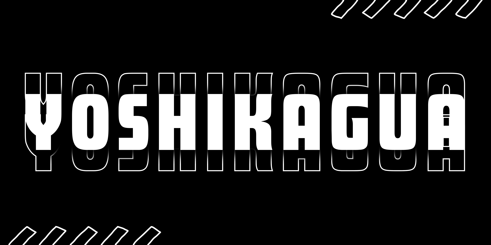

---

<h3 align="left">👨‍💻 Acerca de mí</h3>

Soy estudiante de Ingeniería de Sistemas y Computación con un fuerte interés en el desarrollo de software. Me apasiona aprender y estoy iniciando en mi camino de aprendizaje para volverme un desarrollador fullstack.
  
🔭 Actualmente, no me encuentro trabajando, me dedico al estudio y el aprendizaje en el desarrollo de aplicaciones web con un enfoque en rendimiento y accesibilidad.
  
📚 Mi objetivo profesional es mejorar continuamente mis habilidades en diseño de software, implementación de algoritmos, optimización de código y adopción de buenas prácticas en el desarrollo ágil.

---

<h3 align="left">🛠 Lenguajes y herramientas</h3>

<h4 align="left">🖌️ Frontend</h4>

  

<h4 align="left">💻 Backend</h4>

  

<h4 align="left">🛟 Extras</h4>

  

---

<h3 align="left">📫 Contacto</h3>

  
  

